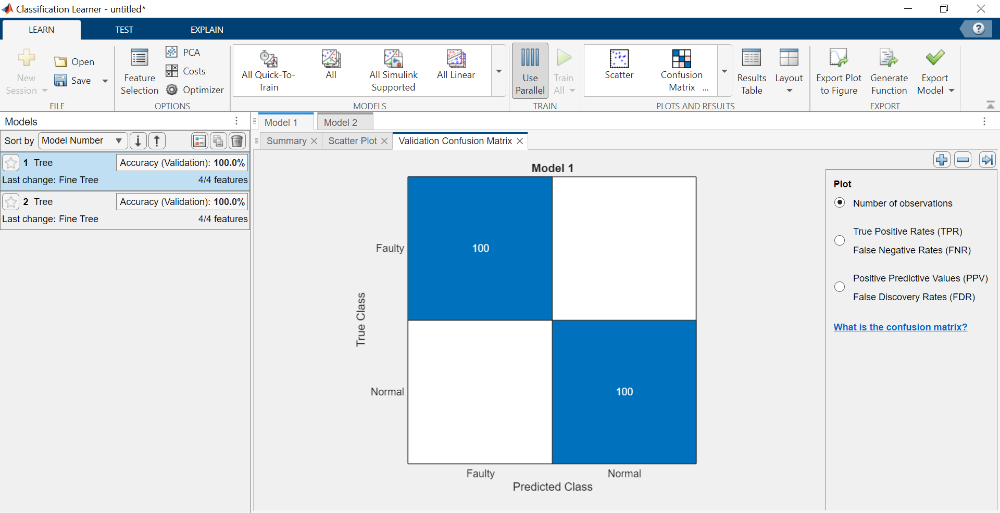
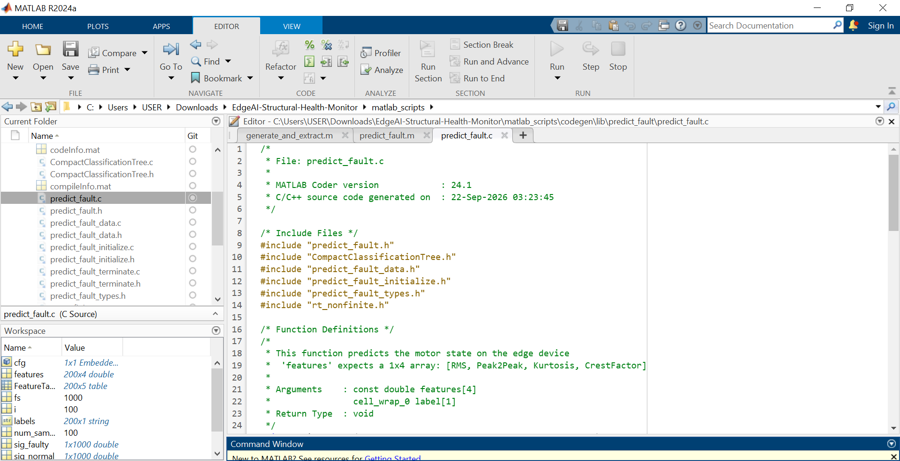
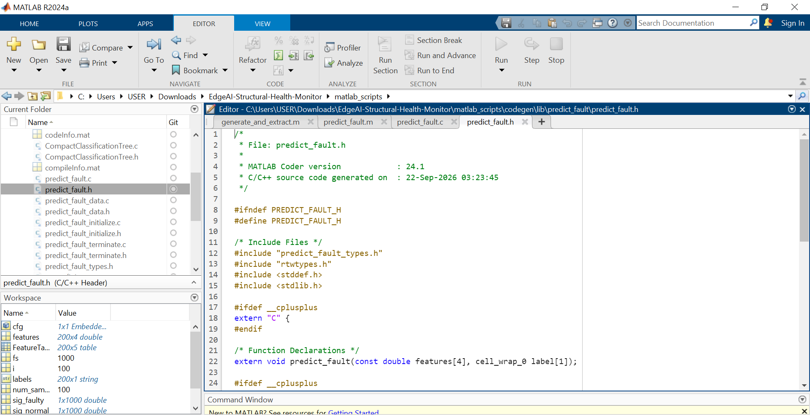

# Ultra-Low-Power Edge AI for Structural Health Monitoring

## Overview
This project demonstrates a complete TinyML (Edge AI) pipeline for structural health monitoring and motor fault detection. Designed with the constraints of embedded systems in mind, the system classifies machine vibration data to detect anomalies without relying on cloud computation.

This project utilizes **Model-Based Design (MBD)** to bridge the gap between high-level machine learning and low-level embedded hardware.

## Core Objectives
* **Resource-Constrained AI:** Train a lightweight classification model (Decision Tree/SVM) optimized for edge deployment.
* **Hardware-Agnostic Generation:** Utilize MATLAB Coder to translate the trained ML model into highly optimized, standalone C/C++ code.
* **Simulated Edge Execution:** Verify the memory footprint and execution logic for deployment on ARM Cortex-M or ESP32 microcontrollers.

## Repository Structure
* `/data` - Sample vibration datasets (Normal vs. Fault states).
* `/matlab_scripts` - Signal processing, feature extraction (Time/Frequency domain), and model training workflows.
* `/generated_c_code` - The standalone C/C++ source and header files ready for microcontroller flashing.

## Methodology
1. **Signal Processing:** Raw vibration signals are windowed, with time-domain and frequency-domain (FFT) features extracted to reduce computational load on the edge device.
2. **Model Training:** A lightweight classification model is trained to distinguish between healthy and faulty operational states.
3. **Code Generation:** The prediction function is compiled into standalone C code, proving software readiness for MCU deployment.

## Results

**100% Validation Accuracy on Edge Model:**

**Generated Standalone C-Code (ANSI C89/90 Standard for ARM/ESP32):**

